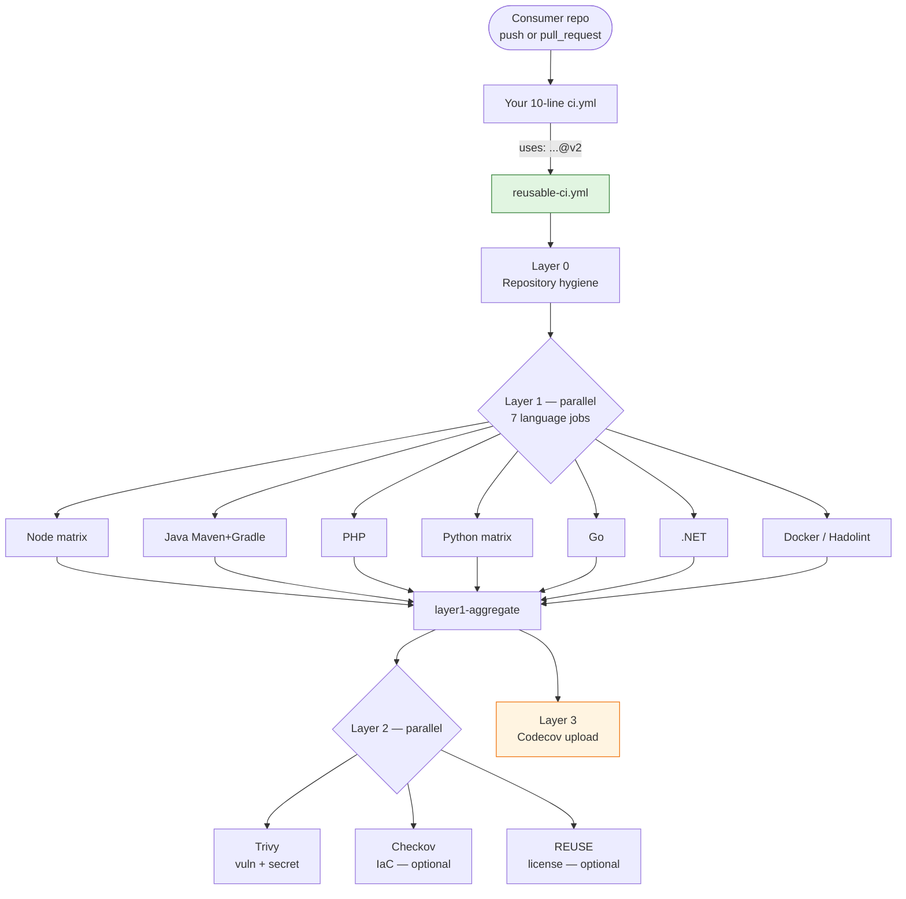

<div align="center">

# ci-templates

**Enterprise-grade reusable GitHub Actions workflow for Node.js, Java, PHP, Python, Go, .NET and Docker projects.**

A single ~10-line drop-in `ci.yml` gives your repository a fully-fledged CI/CD pipeline with repository hygiene, multi-language linting & testing with coverage, and a four-layer supply-chain security stack. Maintain once, deploy everywhere.

<br />

[](https://github.com/2029193370/ci-templates/actions/workflows/ci-lint.yml)
[](https://github.com/2029193370/ci-templates/actions/workflows/codeql.yml)
[](https://github.com/2029193370/ci-templates/actions/workflows/zizmor.yml)
[](https://github.com/2029193370/ci-templates/actions/workflows/gitleaks.yml)
[](https://github.com/2029193370/ci-templates/actions/workflows/scorecard.yml)
[](https://scorecard.dev/viewer/?uri=github.com/2029193370/ci-templates)
[](./LICENSE)
[](https://github.com/2029193370/ci-templates/releases)

**English** &nbsp;|&nbsp; [简体中文](./README.zh-CN.md)

[30-Second Setup](#30-second-setup) &nbsp;·&nbsp; [Quick Start](#quick-start) &nbsp;·&nbsp; [Features](#features) &nbsp;·&nbsp; [Configuration](#configuration) &nbsp;·&nbsp; [Security Model](#security-model) &nbsp;·&nbsp; [FAQ](#faq) &nbsp;·&nbsp; [Contributing](./CONTRIBUTING.md) &nbsp;·&nbsp; [Code of Conduct](./CODE_OF_CONDUCT.md)

</div>

---

## 30-Second Setup

Pick whichever style you prefer — all three give you the same result: a `.github/workflows/ci.yml` file that inherits the full enterprise pipeline.

### Option A &nbsp; One-line installer (recommended)

Run this from the **root of your project** (the directory containing `.git`).

**macOS / Linux / WSL / Git Bash**

```bash
curl -fsSL https://raw.githubusercontent.com/2029193370/ci-templates/main/scripts/install.sh | bash
```

**Windows PowerShell**

```powershell
iwr -useb https://raw.githubusercontent.com/2029193370/ci-templates/main/scripts/install.ps1 | iex
```

The installer creates `.github/workflows/ci.yml`, then prints the three-command commit recipe. It aborts safely if:

- you're not in a git repo, or
- `ci.yml` already exists (it will ask before overwriting; set `CI_TEMPLATES_FORCE=1` to skip the prompt).

For fully reproducible builds, pin the installer itself to a release tag instead of `main`:

```bash
curl -fsSL https://raw.githubusercontent.com/2029193370/ci-templates/v2.0.0/scripts/install.sh | bash
```

> **Security note.** You can (and should) read the script before piping it to a shell:
> [`scripts/install.sh`](./scripts/install.sh) · [`scripts/install.ps1`](./scripts/install.ps1).
> The script only downloads a single YAML file into your repo — no elevated permissions, no background tasks, no telemetry.

### Option B &nbsp; "Use this template" button

Click **[Use this template](https://github.com/2029193370/ci-templates/generate)** on the repository page (or use the link) to create a brand-new repository pre-populated with the starter structure. Perfect if you're starting a project from scratch.

### Option C &nbsp; Manual copy (3 lines)

Create `.github/workflows/ci.yml` in your repository with these contents and push:

```yaml
name: CI & Security Scan
on: { push: { branches: [main] }, pull_request: { branches: [main] } }
permissions: { contents: read }
jobs:
  ci:
    uses: 2029193370/ci-templates/.github/workflows/reusable-ci.yml@v2
```

That's it — **8 lines** for a full enterprise-grade pipeline. For the richer starter file with every input documented, see [`starter/.github/workflows/ci.yml`](./starter/.github/workflows/ci.yml).

### What happens next?

1. On your **first push / pull request**, the 3-layer pipeline runs (hygiene → multi-language lint+build+test → 4-layer security).
2. Jobs for languages you don't use auto-detect and exit in seconds.
3. Every time a new `@v2.*` release ships here, **your repository automatically picks it up on the next CI trigger** — no PR to merge, no email to read.

Want matrix testing or non-default inputs? See [Configuration →](#configuration).

---

## Table of Contents

- [30-Second Setup](#30-second-setup)
- [Why ci-templates](#why-ci-templates)
- [Features](#features)
- [Architecture](#architecture)
- [Quick Start](#quick-start)
- [Supported Stacks](#supported-stacks)
- [Configuration](#configuration)
  - [Inputs](#inputs)
  - [Secrets](#secrets)
  - [Matrix testing](#matrix-testing)
- [Security Model](#security-model)
- [Versioning & Upgrade Policy](#versioning--upgrade-policy)
- [How Updates Reach Downstream Repositories](#how-updates-reach-downstream-repositories)
- [Workflow Catalog](#workflow-catalog)
- [FAQ](#faq)
- [Migration](#migration)
- [Contributing](#contributing)
- [Security Policy](#security-policy)
- [License](#license)
- [Acknowledgments](#acknowledgments)

---

## Why ci-templates

Most teams copy-paste the same `ci.yml` between repositories, drift apart over time, and end up with inconsistent security posture. `ci-templates` fixes this by publishing **one** reusable workflow you include from every repository:

- **Maintain once, propagate everywhere.** Every consumer repo that pins `@v2` automatically picks up improvements on its next CI run — no pull request, no email, no manual bump.
- **Enterprise defaults out of the box.** SHA-pinned actions, runtime egress firewall, full-history secret scanning, industry Scorecard grading, automated Conventional-Commits releases.
- **Language-agnostic.** Seven stacks detected automatically; irrelevant jobs skip themselves. Multi-version matrix testing for Node and Python built in.
- **Safe by default, strict when you need.** Opt-in switches for IaC scanning, license compliance, strict egress blocking.

---

## Features

### Multi-language Layer 1

Auto-detects the stack per job and runs lint + build + unit tests + coverage. Irrelevant jobs exit gracefully.

| Stack | Detection | Lint / Build | Tests | Coverage output |
|-------|-----------|--------------|-------|-----------------|
| Node.js / TypeScript | `package.json` | `npm ci` → `npm run lint` → `npm run build` | `npm test` | `coverage/` → Codecov |
| Java (Maven) | `pom.xml` | `mvn verify` | (same) | JaCoCo `target/site/jacoco/` |
| Java (Gradle) | `build.gradle*` | `gradle check assemble` | (same) | JaCoCo `build/reports/jacoco/` |
| PHP / Laravel | `composer.json` or any `*.php` | `composer install` → `php -l` | `composer test` / PHPUnit | custom |
| Python | `pyproject.toml` / `requirements.txt` / `setup.py` / `Pipfile` | Flake8 E9/F63/F7/F82 | `pytest --cov` | `coverage.xml` |
| Go | `go.mod` | `go vet` → `go build` | `go test -race` | `coverage.out` |
| .NET (C#, F#) | `*.csproj` / `*.sln` / `*.fsproj` | `dotnet restore` → `dotnet build -c Release` | `dotnet test` | Cobertura XML |
| Docker | `Dockerfile` / `Dockerfile.*` | Hadolint (warning threshold) | — | — |

### Supply-chain security

| Tool | Scope | Signal |
|------|-------|--------|
| [step-security/harden-runner](https://github.com/step-security/harden-runner) | Runtime egress on every job | Audit or block outbound traffic |
| [CodeQL](https://codeql.github.com/) | `actions` language (for workflow templates) | Code Scanning |
| [zizmor](https://zizmor.sh/) | GitHub Actions static analysis | SARIF uploaded |
| [gitleaks](https://github.com/gitleaks/gitleaks) | Full git-history secret scan | PR status check |
| [Trivy](https://trivy.dev/) | Filesystem vuln + secret scan, post-compromise-safe pinned version | CRITICAL/HIGH fails by default |
| [Checkov](https://www.checkov.io/) | IaC (Terraform / Kubernetes / Dockerfile / Secrets / Actions) | SARIF uploaded |
| [REUSE](https://reuse.software/) | SPDX license compliance | Optional |
| [OpenSSF Scorecard](https://scorecard.dev/) | Weekly industry security grading | Badge + SARIF |

### Developer experience

- Pre-configured **Dependabot** covering 9 ecosystems with single-PR weekly grouping to avoid notification spam.
- **release-please** produces Conventional-Commits-based releases, fast-forwards the sliding `v1`/`v2` major tag.
- **commitlint** enforces Conventional Commits on PR titles.
- **CODEOWNERS**, PR template, issue forms, `SECURITY.md`, `CONTRIBUTING.md` for ready-to-govern repositories.
- `.gitattributes` normalises line endings across Windows, macOS and Linux contributors.

---

## Architecture



Every job starts with `step-security/harden-runner`. Every `uses:` reference is pinned to a commit SHA, with the tag kept as a trailing comment and auto-rotated by Dependabot.

---

## Quick Start

### Step 1 — Add the workflow

Copy [`starter/.github/workflows/ci.yml`](./starter/.github/workflows/ci.yml) into your repository at the same path:

```yaml
name: CI & Security Scan

on:
  push:
    branches: ['main']
  pull_request:
    branches: ['main']
  workflow_dispatch:

concurrency:
  group: ${{ github.workflow }}-${{ github.ref }}
  cancel-in-progress: true

permissions:
  contents: read

jobs:
  ci:
    uses: 2029193370/ci-templates/.github/workflows/reusable-ci.yml@v2
    # All inputs are optional and have sensible defaults.
    # with:
    #   node-versions: '["20","22"]'
    #   python-versions: '["3.11","3.12"]'
    #   enable-checkov: true
    # secrets:
    #   CODECOV_TOKEN: ${{ secrets.CODECOV_TOKEN }}
```

### Step 2 — Push and watch

Commit the file, push to `main`, and every push / PR thereafter triggers the full three-layer pipeline. Jobs for languages you don't use will exit within seconds.

### Step 3 (optional) — Enable Dependabot for your own dependencies

Copy [`starter/.github/dependabot.yml`](./starter/.github/dependabot.yml) and delete ecosystem blocks you don't need. The template is pre-configured to produce at most one grouped PR per ecosystem per week.

> You do **not** need Dependabot to update the workflow itself. The `@v2` sliding tag is maintained by this repository and automatically picked up on your next CI run.

---

## Supported Stacks

Any combination of the following projects in the same repository will be detected and handled in parallel:

| Ecosystem | Default version | Override input |
|-----------|-----------------|----------------|
| Node.js | 22 | `node-version` or `node-versions` (matrix) |
| Java | 17 LTS | `java-version` |
| PHP | 8.2 | `php-version` |
| Python | 3.11 | `python-version` or `python-versions` (matrix) |
| Go | 1.22 | `go-version` |
| .NET | 8.0 | `dotnet-version` |
| Docker | — (Hadolint) | — |

---

## Configuration

### Inputs

All inputs are optional.

| Input | Type | Default | Description |
|-------|------|---------|-------------|
| `node-version` | string | `'22'` | Single Node.js version. Ignored when `node-versions` is set. |
| `node-versions` | string | `''` | JSON array for matrix testing, e.g. `'["20","22"]'`. |
| `java-version` | string | `'17'` | Temurin LTS: `17` or `21`. |
| `php-version` | string | `'8.2'` | PHP runtime version. |
| `python-version` | string | `'3.11'` | Single Python version. |
| `python-versions` | string | `''` | JSON array for matrix testing, e.g. `'["3.11","3.12"]'`. |
| `go-version` | string | `'1.22'` | Go toolchain version. |
| `dotnet-version` | string | `'8.0'` | .NET SDK version. |
| `trivy-severity` | string | `'CRITICAL,HIGH'` | Comma-separated severities reported by Trivy. |
| `trivy-exit-code` | string | `'1'` | `'1'` to fail the build on findings, `'0'` to report only. |
| `enable-checkov` | boolean | `true` | Run Checkov IaC scan when relevant files are detected. |
| `enable-license-scan` | boolean | `false` | Run REUSE SPDX compliance scan. |
| `fail-fast-on-hygiene` | boolean | `false` | Block Layer 1+ if Layer 0 hygiene fails. |
| `harden-runner-policy` | string | `'audit'` | `'audit'` or `'block'` egress policy. |

### Secrets

| Secret | Purpose |
|--------|---------|
| `CODECOV_TOKEN` | Optional. When present, Layer 3 uploads aggregated coverage to Codecov. |

### Matrix testing

Use JSON array inputs to test multiple language versions in parallel:

```yaml
with:
  node-versions: '["18","20","22"]'
  python-versions: '["3.10","3.11","3.12"]'
```

Both matrix jobs run in parallel and produce separate coverage artifacts named `coverage-node-<version>` / `coverage-python-<version>`, aggregated by Layer 3.

---

## Security Model

### Defense in depth

```text
┌──────────────────────────────────────────────────────────┐
│ Contribution gate                                        │
│   commitlint · CODEOWNERS · branch protection            │
├──────────────────────────────────────────────────────────┤
│ Static analysis (on every PR)                            │
│   CodeQL · zizmor · yamllint                             │
├──────────────────────────────────────────────────────────┤
│ Secret detection (on every push, full git history)       │
│   gitleaks · Trivy secret scan                           │
├──────────────────────────────────────────────────────────┤
│ Runtime hardening (on every job)                         │
│   step-security/harden-runner egress firewall            │
├──────────────────────────────────────────────────────────┤
│ Dependency hygiene                                       │
│   SHA-pinned actions · Dependabot · Trivy vuln scan      │
├──────────────────────────────────────────────────────────┤
│ Continuous grading                                       │
│   OpenSSF Scorecard (weekly SARIF)                       │
└──────────────────────────────────────────────────────────┘
```

### SHA pinning

Every third-party action inside this repository is pinned to a full 40-character commit SHA, with the human-readable tag kept as a trailing comment:

```yaml
uses: actions/checkout@11bd71901bbe5b1630ceea73d27597364c9af683 # v4.2.2
```

Dependabot automatically opens a single grouped pull request per week when upstream releases a new tag. This neutralises the class of supply-chain attacks where a mutable tag is re-pointed at malicious code after adoption.

Note that the file in [`starter/`](./starter/.github/workflows/ci.yml) is intentionally **not** SHA-pinned — downstream users need to be able to read and edit it without resolving commit hashes. They receive updates through the sliding `v2` tag, which we maintain.

### Least privilege

Every workflow declares an explicit top-level `permissions: contents: read`, with job-level overrides only when strictly required (for example `security-events: write` on CodeQL and Scorecard).

### Reporting vulnerabilities

Please use GitHub's private advisory flow, not public issues. Details are in [`SECURITY.md`](./SECURITY.md).

---

## Versioning & Upgrade Policy

This project follows [Semantic Versioning 2.0.0](https://semver.org/). Releases are driven by [release-please](https://github.com/googleapis/release-please) from [Conventional Commits](https://www.conventionalcommits.org/):

- `feat(...)` bumps minor (`v2.0.0` → `v2.1.0`).
- `fix(...)` / `perf(...)` bumps patch (`v2.0.0` → `v2.0.1`).
- `feat!:` or `BREAKING CHANGE:` footer bumps major (`v2.x.y` → `v3.0.0`).

| Reference style in your `ci.yml` | Auto-updates | Reproducibility | Recommended for |
|----------------------------------|--------------|-----------------|-----------------|
| `@v2` (sliding major) | Yes, on every CI run | Medium | Most projects (**default**) |
| `@v2.0.0` (exact tag) | No | High | Regulated / audited environments |
| `@<40-char SHA>` | No | Highest | Maximum supply-chain paranoia |
| `@main` | Yes, very aggressively | Low | Local testing of this repo only |

We maintain the current and the previous major version with security patches. See [`SECURITY.md`](./SECURITY.md) for the current support matrix.

---

## How Updates Reach Downstream Repositories

```text
 ci-templates repo                           consumer repo
─────────────────────                     ────────────────────
                                          uses: ...@v2  (unchanged)
 1. Merge "fix:" PR to main
 2. release-please opens
    Release PR
 3. You merge Release PR
 4. Auto: tag v2.0.1,
    publish GitHub Release,
    force-update v2 → v2.0.1  ────────►   Next CI run here:
                                          GitHub resolves @v2
                                          to the new commit SHA,
                                          and the new workflow
                                          runs transparently.
```

No pull request is opened in the consumer repository. No email is sent. The update propagates on the next push, PR, or schedule trigger in the consumer repository.

### Emergency rollback

If a release misbehaves, the sliding tag is a reversible pointer:

```bash
git tag -f v2 v2.0.0          # locally repoint v2 at a known-good commit
git push -f origin v2         # every downstream repo is healed on its next CI run
```

---

## Workflow Catalog

| File | Trigger | Purpose |
|------|---------|---------|
| `.github/workflows/reusable-ci.yml` | `workflow_call` | Published reusable pipeline — the public API of this repository |
| `.github/workflows/ci-lint.yml` | push / PR affecting workflows | Validates YAML syntax of workflow files |
| `.github/workflows/codeql.yml` | push / PR / weekly | CodeQL analysis of `actions` language |
| `.github/workflows/zizmor.yml` | push / PR / weekly | GitHub Actions static security analysis |
| `.github/workflows/gitleaks.yml` | push / PR / weekly | Full git-history secret scanning |
| `.github/workflows/scorecard.yml` | push / weekly | OpenSSF Scorecard grading |
| `.github/workflows/commitlint.yml` | PR | Enforces Conventional Commits on PR titles |
| `.github/workflows/release-please.yml` | push to main | Automates releases and sliding major tags |
| `.github/dependabot.yml` | weekly cron | Grouped dependency update PRs |

---

## FAQ

### Does my project get updates automatically?

Yes, if you pin `@v2`. Every release we publish is picked up on your repository's next CI run. No pull request is opened against your repository.

### How do I pin for maximum reproducibility?

Replace `@v2` with an exact tag like `@v2.0.0`, or with a 40-character commit SHA. You will then opt out of automatic updates.

### A language job I don't use is listed as skipped — is that a problem?

No. Every Layer 1 job first runs a detection step and exits in under a minute if the relevant manifest file is absent.

### `harden-runner` in `block` mode is killing my CI

Start with `harden-runner-policy: 'audit'`, merge your first few green runs, inspect the "Network Traffic" insights tab to see what hosts you legitimately need, and only then switch to `block`. You can always fall back to `'audit'` while you investigate.

### How do I enable coverage upload?

Add `CODECOV_TOKEN` as a repository secret, and pass it through:

```yaml
secrets:
  CODECOV_TOKEN: ${{ secrets.CODECOV_TOKEN }}
```

### What about monorepos?

The current template treats the repository root as the entry point. Monorepos typically need a bespoke caller workflow that runs the reusable workflow per package/workspace. Contributions adding first-class monorepo support are welcome.

### Can I fork and host my own version?

Absolutely. `ci-templates` is MIT-licensed. If you fork, please update the `uses:` references in `starter/` to point at your fork and update any badge URLs.

### `release-please` did not open a Release PR

It only reacts to Conventional Commits. If your squash commit is titled `Merge pull request #42`, it is ignored. Configure your repository so that squash merges use the PR title, and ensure that PR title passes `commitlint`.

### Why is REUSE license scanning off by default?

REUSE requires SPDX headers on every source file, which most projects cannot retrofit overnight. Turn it on with `enable-license-scan: true` when your team is ready.

---

## Migration

### From v1.x to v2.x

- Change `uses: ...@v1` to `uses: ...@v2`.
- Input names now use kebab-case throughout (previously mixed). Notable rename: `trivy_exit_code` → `trivy-exit-code`.
- Layer 1 now runs tests and produces coverage artifacts named `coverage-<stack>-<version>`; the old `coverage-report` name is gone.
- Start `harden-runner-policy` in `'audit'` mode, then switch to `'block'` once your allowlist is stable.
- If you relied on the previous single-version jobs, note that Node and Python now support matrix inputs; default behaviour is unchanged.

---

## Contributing

Pull requests, bug reports and feature ideas are very welcome. Please start with [`CONTRIBUTING.md`](./CONTRIBUTING.md). All contributors are expected to follow the project's Code of Conduct (Contributor Covenant 2.1 — see the `CONTRIBUTING.md` header).

Before opening a PR:

1. Run `yamllint -c .yamllint .github/workflows starter/.github/workflows .github/dependabot.yml`.
2. Optionally run `zizmor .github/workflows` locally.
3. Write your commit / PR title in Conventional Commits style — this is enforced by `commitlint` on every PR.

---

## Security Policy

See [`SECURITY.md`](./SECURITY.md). Report vulnerabilities privately through [GitHub Security Advisories](https://github.com/2029193370/ci-templates/security/advisories/new) — **do not open a public issue**.

---

## Contributors

Thanks to everyone who has opened an issue, sent a patch or helped review pull requests.

<a href="https://github.com/2029193370/ci-templates/graphs/contributors">
  
</a>

_Image generated by [contrib.rocks](https://contrib.rocks)._

---

## Star History

<a href="https://star-history.com/#2029193370/ci-templates&Date">
  <picture>
    <source media="(prefers-color-scheme: dark)" srcset="https://api.star-history.com/svg?repos=2029193370/ci-templates&type=Date&theme=dark" />
    <source media="(prefers-color-scheme: light)" srcset="https://api.star-history.com/svg?repos=2029193370/ci-templates&type=Date" />
    
  </picture>
</a>

---

## License

Released under the [MIT License](./LICENSE). You are free to use, modify, fork, host and distribute this template commercially, with or without attribution.

---

## Acknowledgments

`ci-templates` stands on the shoulders of the following projects:

- [step-security/harden-runner](https://github.com/step-security/harden-runner) — runtime egress control
- [aquasecurity/trivy](https://trivy.dev/) — vulnerability and secret scanner
- [zizmorcore/zizmor](https://zizmor.sh/) — GitHub Actions static analyser
- [gitleaks/gitleaks](https://github.com/gitleaks/gitleaks) — secret detection
- [ossf/scorecard](https://scorecard.dev/) — OpenSSF Scorecard
- [bridgecrewio/checkov](https://www.checkov.io/) — IaC scanner
- [fsfe/reuse-action](https://github.com/fsfe/reuse-action) — SPDX compliance
- [googleapis/release-please](https://github.com/googleapis/release-please) — release automation
- [github/codeql-action](https://codeql.github.com/) — static analysis

Thanks to everyone maintaining the GitHub Actions used by this template.
