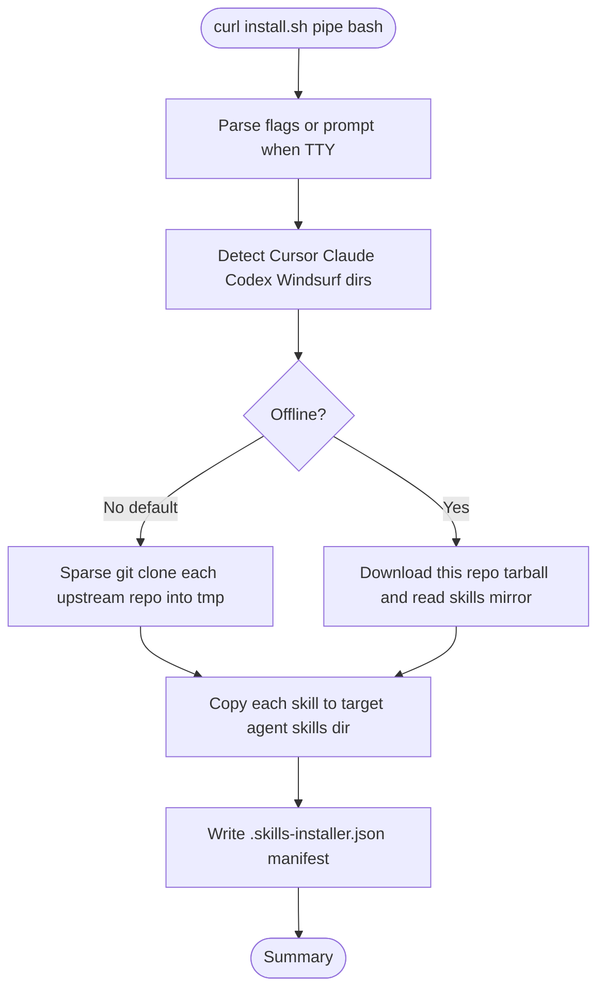

<div align="center">

# skills-installer

**One command. All your agent skills. Every IDE.**

Install the six most useful agent skills — `document-skills`, `frontend-design`, `skill-creator`, `ui-ux-pro-max`, `find-skills`, `superpowers` — globally into Cursor, Claude Code, Codex CLI and Windsurf, with a single line of shell.

<br />

[](https://github.com/2029193370/skills/actions/workflows/ci-lint.yml)
[](https://github.com/2029193370/skills/actions/workflows/codeql.yml)
[](https://github.com/2029193370/skills/actions/workflows/zizmor.yml)
[](https://github.com/2029193370/skills/actions/workflows/gitleaks.yml)
[](https://github.com/2029193370/skills/actions/workflows/scorecard.yml)
[](./LICENSE)
[](https://github.com/2029193370/skills/releases)

**English** &nbsp;|&nbsp; [简体中文](./README.zh-CN.md)

[Quick Start](#quick-start) &nbsp;·&nbsp; [Skills](#included-skills) &nbsp;·&nbsp; [Targets](#supported-agents) &nbsp;·&nbsp; [CLI](#cli-reference) &nbsp;·&nbsp; [FAQ](#faq)

</div>

---

## Quick Start

### macOS / Linux / WSL / Git Bash

```bash
curl -fsSL https://raw.githubusercontent.com/2029193370/skills/main/scripts/install.sh | bash
```

### Windows PowerShell

```powershell
iwr -useb https://raw.githubusercontent.com/2029193370/skills/main/scripts/install.ps1 | iex
```

That is literally all. The installer will:

1. Detect which of Cursor / Claude Code / Codex / Windsurf you have installed.
2. Fetch the six skills from upstream (sparse clone — only the bytes you need).
3. Drop each one into the right global skills directory for every detected agent.
4. Write a tiny manifest so `--uninstall` can undo it later.

Non-interactive one-shot (for CI or dotfiles bootstrapping):

```bash
curl -fsSL https://raw.githubusercontent.com/2029193370/skills/main/scripts/install.sh \
  | bash -s -- --agent=cursor --skills=superpowers,find-skills --yes
```

---

## Included skills

Everything in [`registry.json`](./registry.json). To add your own, see [`docs/ADDING_A_SKILL.md`](./docs/ADDING_A_SKILL.md).

| Skill | What it does | Upstream | License |
| ----- | ------------ | -------- | ------- |
| `document-skills` | Read / write Excel, Word, PDF, PPT end-to-end | [anthropics/skills](https://github.com/anthropics/skills) | Source-available |
| `frontend-design` | Production-grade frontend interfaces with opinionated aesthetic direction | [anthropics/skills](https://github.com/anthropics/skills) | Source-available |
| `skill-creator` | Author, evaluate and iterate on your own skills | [anthropics/skills](https://github.com/anthropics/skills) | Source-available |
| `ui-ux-pro-max` | 57 UI styles, 95 palettes, 56 font pairings, 98 UX guidelines | [nextlevelbuilder/ui-ux-pro-max-skill](https://github.com/nextlevelbuilder/ui-ux-pro-max-skill) | MIT |
| `find-skills` | Discover and install more skills when you say "is there a skill for X?" | [aqianer/find-skills](https://github.com/aqianer/find-skills) | MIT |
| `superpowers` | 30+ meta-skills — brainstorming, planning, TDD, subagent dispatch | [obra/superpowers-skills](https://github.com/obra/superpowers-skills) | MIT |

> **License note.** The three Anthropic skills are source-available, not open source. In the default online mode the installer fetches them directly from upstream — this project never redistributes their content. Under `--offline` they are skipped with a clear warning; only the three MIT-licensed skills are bundled as an offline mirror under [`skills/`](./skills/).

---

## Supported agents

| Agent | Detection | Global skills dir | Project skills dir |
| ----- | --------- | ----------------- | ------------------ |
| Cursor | `~/.cursor/` exists | `~/.cursor/skills/` | `./.cursor/skills/` |
| Claude Code | `~/.claude/` exists (or `$CLAUDE_CONFIG_DIR`) | `~/.claude/skills/` | `./.claude/skills/` |
| Codex CLI | `~/.codex/` exists | `~/.codex/skills/` | *(n/a)* |
| Windsurf (Codeium) | `~/.codeium/windsurf/` exists | `~/.codeium/windsurf/skills/` | `./.windsurf/skills/` |

Run the installer from *any* directory for global scope, or from a repo root with `--scope=project` to install just for that project.

---

## CLI reference

```
Usage: install.sh [OPTIONS]

Actions:
  --install                  (default)
  --uninstall
  --list                     Preview without writing

Selection:
  --agent=<all|cursor|claude|codex|windsurf>    Target agent family. Default: all (installed only).
  --scope=<global|project>                      Default: global.
  --skills=<all|name1,name2,...>                Default: all.

Modes:
  --offline                  Use the bundled MIT mirror; no network. Source-available
                             skills are skipped with a warning.
  --force                    Overwrite existing skill directories without asking.
  --dry-run                  Print what would happen; touch nothing.
  --yes, -y                  Assume yes to every prompt.

Environment:
  SKILLS_INSTALLER_REPO    Default: 2029193370/skills
  SKILLS_INSTALLER_REF     Default: main (branch, tag or commit)
```

PowerShell takes the same switches with PascalCase names: `-Agent`, `-Scope`, `-Skills`, `-Offline`, `-Force`, `-DryRun`, `-Yes`, `-Action`.

### Examples

```bash
# Preview without writing
curl -fsSL .../install.sh | bash -s -- --list

# Install only two skills into Cursor global
curl -fsSL .../install.sh | bash -s -- --agent=cursor --skills=superpowers,find-skills

# Install to current project (e.g. inside a monorepo)
curl -fsSL .../install.sh | bash -s -- --scope=project

# Offline, pinned to a release tag
SKILLS_INSTALLER_REF=v1.0.0 \
  curl -fsSL .../install.sh | bash -s -- --offline

# Uninstall everything we put there
curl -fsSL .../install.sh | bash -s -- --uninstall --agent=all
```

---

## How it works



For each skill, the tool performs a `git clone --depth 1 --filter=blob:none --sparse` of its upstream repo and then `git sparse-checkout set <paths>`, so only the bytes you actually install are ever downloaded. Large monorepos like `anthropics/skills` cost roughly the size of the one subdirectory you asked for.

---

## FAQ

### Why does `--offline` skip half the skills?

The three Anthropic skills (`document-skills`, `frontend-design`, `skill-creator`) ship under a source-available license that does not grant redistribution rights. Bundling them here would make **this** repository a redistribution, which is exactly what their license forbids. `--online` (the default) lets your own machine fetch them directly from upstream, which is always legal for personal use. Skills that carry an MIT license are mirrored under [`skills/`](./skills/) and therefore work offline.

### I want to add my own skill to the installer

Open a PR that adds an entry to [`registry.json`](./registry.json). The schema is documented in [`registry.schema.json`](./registry.schema.json) and in [`docs/ADDING_A_SKILL.md`](./docs/ADDING_A_SKILL.md). If your skill is MIT / Apache / BSD licensed and you want it mirrored for `--offline`, add it to `scripts/sync-upstream.sh`'s next run by setting `"redistributable": true`.

### How do I upgrade installed skills?

Re-run the one-liner with `--force`. It will overwrite whatever is currently in your agent's skills dir with the latest upstream content. Pin `SKILLS_INSTALLER_REF=vX.Y.Z` if you want deterministic upgrades.

### Where did the installer put things?

After a successful run look at `<agent skills dir>/.skills-installer.json`. It lists every path the installer created, plus the ref it used. `--uninstall` reads that manifest back to clean up precisely.

### Does this work offline?

Yes, with caveats. Pass `--offline` and the installer downloads one tarball of this repo (~300 KB), extracts the MIT skills and copies them in. The three Anthropic skills are skipped — re-run online when you can.

### Can I pin to a specific release?

Yes:

```bash
SKILLS_INSTALLER_REF=v1.0.0 curl -fsSL \
  https://raw.githubusercontent.com/2029193370/skills/v1.0.0/scripts/install.sh | bash
```

Both the code and the registry are resolved at that ref, so the behaviour is fully reproducible.

### Why `curl | bash`?

It is the lowest-friction way to ship a cross-platform installer, and you can always read the script before piping: [`scripts/install.sh`](./scripts/install.sh) / [`scripts/install.ps1`](./scripts/install.ps1). The scripts only touch the four well-known agent skills directories and never ask for elevation.

---

## Security

- No telemetry, no analytics, no background processes.
- Every third-party GitHub Action used by this repo's CI is SHA-pinned. Dependabot keeps them fresh.
- The installer's only disk writes are under the detected agent skills directories plus one manifest file; it never touches your global PATH, shell rc files, registry or PATH.
- To vet the script before running it:

  ```bash
  curl -fsSL https://raw.githubusercontent.com/2029193370/skills/main/scripts/install.sh | less
  ```

Report vulnerabilities via GitHub's private advisory flow — see [`SECURITY.md`](./SECURITY.md).

---

## Contributing

PRs welcome, especially for new skills in `registry.json` or new agent targets. Start with [`CONTRIBUTING.md`](./CONTRIBUTING.md); PR titles must pass [Conventional Commits](https://www.conventionalcommits.org/) because release notes are generated from them.

---

## Contributors

<a href="https://github.com/2029193370/skills/graphs/contributors">
  
</a>

_Image generated by [contrib.rocks](https://contrib.rocks)._

---

## Star History

<a href="https://star-history.com/#2029193370/skills&Date">
  <picture>
    <source media="(prefers-color-scheme: dark)" srcset="https://api.star-history.com/svg?repos=2029193370/skills&type=Date&theme=dark" />
    <source media="(prefers-color-scheme: light)" srcset="https://api.star-history.com/svg?repos=2029193370/skills&type=Date" />
    
  </picture>
</a>

---

## License

Released under the [MIT License](./LICENSE). The skills installed by this tool retain **their own** licenses — see the upstream repos linked in [Included skills](#included-skills).

---

## Acknowledgments

- [anthropics/skills](https://github.com/anthropics/skills) — the `document-skills`, `frontend-design`, `skill-creator` upstreams.
- [obra/superpowers-skills](https://github.com/obra/superpowers-skills) — the agentic software-development methodology.
- [nextlevelbuilder/ui-ux-pro-max-skill](https://github.com/nextlevelbuilder/ui-ux-pro-max-skill) — the UI/UX design intelligence skill.
- [aqianer/find-skills](https://github.com/aqianer/find-skills) — the skill discovery tool.

Standing on the shoulders of giants.
