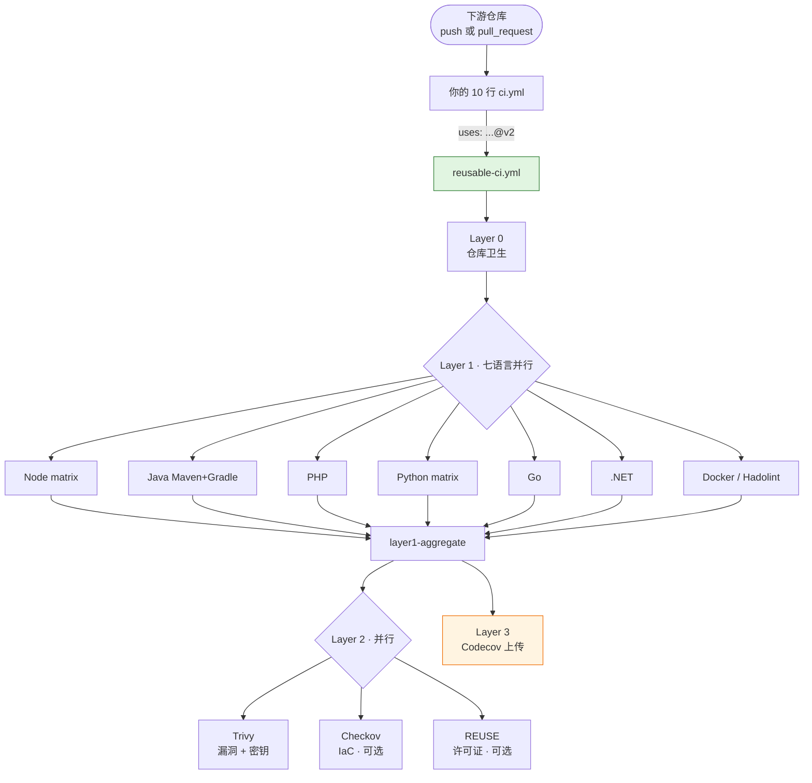

<div align="center">

# ci-templates

**面向 Node.js / Java / PHP / Python / Go / .NET / Docker 项目的企业级可复用 GitHub Actions 工作流。**

下游仓库只需约 10 行的 `ci.yml`，即可获得完整的 CI/CD 流水线：仓库卫生检查、七语言 Lint / Build / Test / Coverage、四层供应链安全。**一次维护，全部下游自动受益。**

<br />

[](https://github.com/2029193370/ci-templates/actions/workflows/ci-lint.yml)
[](https://github.com/2029193370/ci-templates/actions/workflows/codeql.yml)
[](https://github.com/2029193370/ci-templates/actions/workflows/zizmor.yml)
[](https://github.com/2029193370/ci-templates/actions/workflows/gitleaks.yml)
[](https://github.com/2029193370/ci-templates/actions/workflows/scorecard.yml)
[](https://scorecard.dev/viewer/?uri=github.com/2029193370/ci-templates)
[](./LICENSE)
[](https://github.com/2029193370/ci-templates/releases)

[English](./README.md) &nbsp;|&nbsp; **简体中文**

[30 秒接入](#30-秒接入) &nbsp;·&nbsp; [快速开始](#快速开始) &nbsp;·&nbsp; [特性](#特性) &nbsp;·&nbsp; [配置](#配置) &nbsp;·&nbsp; [安全模型](#安全模型) &nbsp;·&nbsp; [常见问题](#常见问题) &nbsp;·&nbsp; [贡献指南](./CONTRIBUTING.md) &nbsp;·&nbsp; [行为准则](./CODE_OF_CONDUCT.md)

</div>

---

## 30 秒接入

三种方式任选其一，效果相同：在你的仓库里生成一份 `.github/workflows/ci.yml`，自动继承全部企业级流水线。

### 方式 A &nbsp; 一行命令安装（推荐）

请在**你项目的根目录**（即包含 `.git` 的目录）下执行。

**macOS / Linux / WSL / Git Bash**

```bash
curl -fsSL https://raw.githubusercontent.com/2029193370/ci-templates/main/scripts/install.sh | bash
```

**Windows PowerShell**

```powershell
iwr -useb https://raw.githubusercontent.com/2029193370/ci-templates/main/scripts/install.ps1 | iex
```

安装脚本会创建 `.github/workflows/ci.yml`，并打印三条提交命令。遇到以下情况会安全退出：

- 当前目录不是 git 仓库；
- `ci.yml` 已存在（会先询问是否覆盖，传入 `CI_TEMPLATES_FORCE=1` 可跳过询问）。

如果你需要**完全可复现**的构建，可以把安装脚本本身也钉到某个发布 tag，而不是 `main`：

```bash
curl -fsSL https://raw.githubusercontent.com/2029193370/ci-templates/v2.0.0/scripts/install.sh | bash
```

> **安全说明**：你可以（也应该）在执行前先阅读脚本内容：
> [`scripts/install.sh`](./scripts/install.sh) · [`scripts/install.ps1`](./scripts/install.ps1)。
> 脚本只做一件事——把一份 YAML 文件下载到你的仓库里。不需要 sudo，不启动后台任务，不包含任何遥测。

### 方式 B &nbsp; 点击 "Use this template" 按钮

在仓库页面点击 **[Use this template](https://github.com/2029193370/ci-templates/generate)**（或直接用该链接），即可基于本模板**创建一个全新仓库**，已经预先包含 starter 结构。适合从零开始新建项目时使用。

### 方式 C &nbsp; 手动复制（3 行）

在你的仓库里创建 `.github/workflows/ci.yml`，写入以下内容然后 push：

```yaml
name: CI & Security Scan
on: { push: { branches: [main] }, pull_request: { branches: [main] } }
permissions: { contents: read }
jobs:
  ci:
    uses: 2029193370/ci-templates/.github/workflows/reusable-ci.yml@v2
```

就这样——**8 行代码**换一条完整的企业级流水线。如需带完整输入注释的 starter 文件，见 [`starter/.github/workflows/ci.yml`](./starter/.github/workflows/ci.yml)。

### 接入之后会发生什么？

1. 你的**首次 push / pull request** 会触发 3 层流水线（仓库卫生 → 多语言 lint+build+test → 4 层安全）。
2. 你项目**没有使用的语言**，对应的 Job 会秒级跳过。
3. 本仓库每发布一个 `@v2.*` 版本，**你的仓库会在下一次 CI 触发时自动采用**——不会产生 PR，也不会收到邮件。

想开启矩阵测试或自定义输入？请看 [配置 →](#配置)。

---

## 目录

- [项目动机](#项目动机)
- [特性](#特性)
- [架构](#架构)
- [30 秒接入](#30-秒接入)
- [快速开始](#快速开始)
- [支持的技术栈](#支持的技术栈)
- [配置](#配置)
  - [输入参数](#输入参数)
  - [密钥](#密钥)
  - [多版本矩阵测试](#多版本矩阵测试)
- [安全模型](#安全模型)
- [版本与升级策略](#版本与升级策略)
- [升级如何传达到下游仓库](#升级如何传达到下游仓库)
- [工作流清单](#工作流清单)
- [常见问题](#常见问题)
- [版本迁移](#版本迁移)
- [贡献指南](#贡献指南)
- [安全策略](#安全策略)
- [许可协议](#许可协议)
- [致谢](#致谢)

---

## 项目动机

许多团队在多个仓库之间复制粘贴相同的 `ci.yml`，时间一长各仓库版本漂移，安全基线参差不齐。`ci-templates` 通过发布**一份**可复用工作流解决这个问题：

- **一次维护，整体受益。** 任何使用 `@v2` 滑动标签的下游仓库，在其下一次 CI 触发时自动接收更新 —— 无 PR、无邮件、无需人工操作。
- **企业级默认配置开箱即用。** SHA 固定的 Actions、运行时出站防火墙、完整历史密钥扫描、OpenSSF Scorecard 行业评分、基于 Conventional Commits 的自动发版。
- **多语言无感知。** 自动检测七种技术栈，不相关的作业自动跳过。Node / Python 内置多版本矩阵测试。
- **默认安全，按需严格。** IaC 扫描、许可证合规、严格出站拦截均为可选开关。

---

## 特性

### Layer 1 多语言构建与测试

每个作业先做检测，再执行 lint / build / 单元测试 / 覆盖率；不相关的作业会在数秒内优雅退出。

| 技术栈 | 检测条件 | Lint / Build | 测试 | 覆盖率产物 |
|--------|----------|--------------|------|-----------|
| Node.js / TypeScript | `package.json` | `npm ci` → `npm run lint` → `npm run build` | `npm test` | `coverage/` → Codecov |
| Java Maven | `pom.xml` | `mvn verify` | 同上 | JaCoCo `target/site/jacoco/` |
| Java Gradle | `build.gradle*` | `gradle check assemble` | 同上 | JaCoCo `build/reports/jacoco/` |
| PHP / Laravel | `composer.json` 或任意 `*.php` | `composer install` → `php -l` | `composer test` / PHPUnit | 自定义 |
| Python | `pyproject.toml` / `requirements.txt` / `setup.py` / `Pipfile` | Flake8 E9/F63/F7/F82 | `pytest --cov` | `coverage.xml` |
| Go | `go.mod` | `go vet` → `go build` | `go test -race` | `coverage.out` |
| .NET (C#, F#) | `*.csproj` / `*.sln` / `*.fsproj` | `dotnet restore` → `dotnet build -c Release` | `dotnet test` | Cobertura XML |
| Docker | `Dockerfile` / `Dockerfile.*` | Hadolint（阈值 warning） | — | — |

### 供应链安全

| 工具 | 适用范围 | 产物 |
|------|---------|------|
| [step-security/harden-runner](https://github.com/step-security/harden-runner) | 每个 job 的运行时出站控制 | 审计或阻断出站流量 |
| [CodeQL](https://codeql.github.com/) | `actions` 语言（适用于工作流模板本身） | Code Scanning |
| [zizmor](https://zizmor.sh/) | GitHub Actions 静态分析 | SARIF |
| [gitleaks](https://github.com/gitleaks/gitleaks) | 完整 git 历史密钥扫描 | PR 状态检查 |
| [Trivy](https://trivy.dev/) | 文件系统漏洞 + 密钥扫描（已避开 2026 年 3 月的供应链攻击版本） | 默认 CRITICAL / HIGH 级别失败 |
| [Checkov](https://www.checkov.io/) | IaC（Terraform / Kubernetes / Dockerfile / Secrets / Actions） | SARIF |
| [REUSE](https://reuse.software/) | SPDX 许可证合规 | 可选 |
| [OpenSSF Scorecard](https://scorecard.dev/) | 每周行业安全评分 | 徽章 + SARIF |

### 开发者体验

- 预配置 **Dependabot** 覆盖 9 个生态，每周合并为单个 PR，避免通知邮件轰炸。
- **release-please** 基于 Conventional Commits 自动发版，并滑动维护 `v1` / `v2` 主版本标签。
- **commitlint** 在 PR 标题强制使用 Conventional Commits。
- 预置 `CODEOWNERS`、PR 模板、Issue 表单、`SECURITY.md`、`CONTRIBUTING.md`，开箱即治理。
- `.gitattributes` 在 Windows / macOS / Linux 之间统一换行符处理。

---

## 架构



每个 job 的第一步都是 `step-security/harden-runner`。每一个 `uses:` 引用均固定到 commit SHA，可读的 tag 保留在行末注释，并由 Dependabot 每周自动维护。

---

## 快速开始

### 第 1 步 — 添加工作流

把 [`starter/.github/workflows/ci.yml`](./starter/.github/workflows/ci.yml) 原样复制到你的仓库相同路径：

```yaml
name: CI & Security Scan

on:
  push:
    branches: ['main']
  pull_request:
    branches: ['main']
  workflow_dispatch:

concurrency:
  group: ${{ github.workflow }}-${{ github.ref }}
  cancel-in-progress: true

permissions:
  contents: read

jobs:
  ci:
    uses: 2029193370/ci-templates/.github/workflows/reusable-ci.yml@v2
    # 所有输入均为可选，带合理默认值。
    # with:
    #   node-versions: '["20","22"]'
    #   python-versions: '["3.11","3.12"]'
    #   enable-checkov: true
    # secrets:
    #   CODECOV_TOKEN: ${{ secrets.CODECOV_TOKEN }}
```

### 第 2 步 — Push 即生效

提交并推送后，后续任何 push 或 PR 都会触发完整的三层流水线。你不使用的语言对应的 job 会在数秒内退出。

### 第 3 步（可选）— 为你自己的依赖启用 Dependabot

复制 [`starter/.github/dependabot.yml`](./starter/.github/dependabot.yml)，删除用不到的生态块即可。模板默认开启静音配置：每生态每周最多一个聚合 PR。

> 你**无需**为工作流本身启用 Dependabot。`@v2` 滑动标签由本仓库维护，你的下一次 CI 运行会自动使用最新版本。

---

## 支持的技术栈

同一仓库可同时包含以下任意组合，检测结果决定哪些 job 执行：

| 生态 | 默认版本 | 覆盖参数 |
|------|----------|----------|
| Node.js | 22 | `node-version` 或 `node-versions`（矩阵） |
| Java | 17 LTS | `java-version` |
| PHP | 8.2 | `php-version` |
| Python | 3.11 | `python-version` 或 `python-versions`（矩阵） |
| Go | 1.22 | `go-version` |
| .NET | 8.0 | `dotnet-version` |
| Docker | —（Hadolint） | — |

---

## 配置

### 输入参数

所有参数均为可选。

| 参数 | 类型 | 默认值 | 说明 |
|------|------|--------|------|
| `node-version` | string | `'22'` | 单一 Node.js 版本。设置 `node-versions` 后被忽略。 |
| `node-versions` | string | `''` | JSON 数组，用于矩阵测试，例如 `'["20","22"]'`。 |
| `java-version` | string | `'17'` | Temurin LTS：`17` 或 `21`。 |
| `php-version` | string | `'8.2'` | PHP 运行时版本。 |
| `python-version` | string | `'3.11'` | 单一 Python 版本。 |
| `python-versions` | string | `''` | JSON 数组，用于矩阵测试，例如 `'["3.11","3.12"]'`。 |
| `go-version` | string | `'1.22'` | Go 工具链版本。 |
| `dotnet-version` | string | `'8.0'` | .NET SDK 版本。 |
| `trivy-severity` | string | `'CRITICAL,HIGH'` | Trivy 报告的严重级别，逗号分隔。 |
| `trivy-exit-code` | string | `'1'` | `'1'` 表示发现问题即失败，`'0'` 表示仅报告。 |
| `enable-checkov` | boolean | `true` | 在检测到 IaC 文件时运行 Checkov。 |
| `enable-license-scan` | boolean | `false` | 运行 REUSE SPDX 许可证合规扫描。 |
| `fail-fast-on-hygiene` | boolean | `false` | Layer 0 失败时阻塞 Layer 1 及以后。 |
| `harden-runner-policy` | string | `'audit'` | `'audit'` 审计或 `'block'` 阻断出站。 |

### 密钥

| 密钥 | 用途 |
|------|------|
| `CODECOV_TOKEN` | 可选。设置后 Layer 3 将聚合覆盖率上传至 Codecov。 |

### 多版本矩阵测试

用 JSON 数组并行测试多个语言版本：

```yaml
with:
  node-versions: '["18","20","22"]'
  python-versions: '["3.10","3.11","3.12"]'
```

矩阵内的各个 job 并行执行，分别产出 `coverage-node-<version>` / `coverage-python-<version>` 工件，由 Layer 3 统一聚合。

---

## 安全模型

### 纵深防御

```text
┌──────────────────────────────────────────────────────────┐
│ 准入门禁                                                 │
│   commitlint · CODEOWNERS · 分支保护                     │
├──────────────────────────────────────────────────────────┤
│ 静态分析（每次 PR）                                      │
│   CodeQL · zizmor · yamllint                             │
├──────────────────────────────────────────────────────────┤
│ 密钥检测（每次推送，完整 git 历史）                      │
│   gitleaks · Trivy 密钥扫描                              │
├──────────────────────────────────────────────────────────┤
│ 运行时加固（每个 job）                                   │
│   step-security/harden-runner 出站防火墙                 │
├──────────────────────────────────────────────────────────┤
│ 依赖卫生                                                 │
│   SHA 固定 Actions · Dependabot · Trivy 漏洞扫描         │
├──────────────────────────────────────────────────────────┤
│ 持续评分                                                 │
│   OpenSSF Scorecard（每周 SARIF）                        │
└──────────────────────────────────────────────────────────┘
```

### SHA 固定

本仓库中每一个第三方 Action 均被固定到 40 位完整 commit SHA，可读的 tag 作为行末注释保留：

```yaml
uses: actions/checkout@11bd71901bbe5b1630ceea73d27597364c9af683 # v4.2.2
```

Dependabot 每周自动为所有新发布的 tag 开出一个合并 PR。这种做法可以防御"可变 tag 被重新指向恶意代码"这一类的供应链攻击。

注意：[`starter/`](./starter/.github/workflows/ci.yml) 中的文件**故意**不做 SHA 固定 —— 下游用户需要能直接阅读与编辑它，无需人工解析 SHA。他们通过我们维护的滑动 `v2` 标签自动获得更新。

### 最小权限

每个工作流顶层声明 `permissions: contents: read`，必要时才在 job 级别细粒度赋权（例如 CodeQL、Scorecard 的 `security-events: write`）。

### 漏洞上报

请使用 GitHub 的私密安全公告流程，**不要**公开提交 Issue。详见 [`SECURITY.md`](./SECURITY.md)。

---

## 版本与升级策略

本项目遵循 [Semantic Versioning 2.0.0](https://semver.org/)。版本由 [release-please](https://github.com/googleapis/release-please) 根据 [Conventional Commits](https://www.conventionalcommits.org/) 自动驱动：

- `feat(...)` 触发 minor（`v2.0.0` → `v2.1.0`）。
- `fix(...)` / `perf(...)` 触发 patch（`v2.0.0` → `v2.0.1`）。
- `feat!:` 或 `BREAKING CHANGE:` 触发 major（`v2.x.y` → `v3.0.0`）。

| 下游 `uses:` 写法 | 自动升级 | 可复现度 | 适用场景 |
|-------------------|----------|----------|----------|
| `@v2`（滑动主版本） | 是，每次 CI 运行 | 中 | 一般项目（**默认**） |
| `@v2.0.0`（精确 tag） | 否 | 高 | 合规 / 审计环境 |
| `@<40 位 SHA>` | 否 | 最高 | 极端合规场景 |
| `@main` | 是，非常激进 | 差 | 仅用于调试本仓库 |

我们维护**当前主版本**与**上一主版本**的安全补丁。详见 [`SECURITY.md`](./SECURITY.md) 中的支持矩阵。

---

## 升级如何传达到下游仓库

```text
 ci-templates 仓库                        下游仓库
─────────────────────                  ────────────────────
                                       uses: ...@v2（无需改动）
 1. 合并 "fix:" PR 到 main
 2. release-please 开 Release PR
 3. 你合并 Release PR
 4. 自动：打 v2.0.1 tag、
    发 GitHub Release、
    强制移动 v2 → v2.0.1 ─────────►    下游下一次 CI：
                                        GitHub 解析 @v2 →
                                        取最新 commit SHA →
                                        新 workflow 自动执行
```

下游仓库**不会收到 PR**，**不会收到邮件**。更新会在下游仓库下一次 push / PR / schedule 触发时自动生效。

### 紧急回滚

滑动标签是可回退的指针。若某次发布出现问题：

```bash
git tag -f v2 v2.0.0          # 本地把 v2 指回已知正常的 commit
git push -f origin v2         # 所有下游仓库在下一次 CI 时自动恢复正常
```

---

## 工作流清单

| 文件 | 触发 | 作用 |
|------|------|------|
| `.github/workflows/reusable-ci.yml` | `workflow_call` | 对外暴露的流水线 —— 本仓库的公共 API |
| `.github/workflows/ci-lint.yml` | 影响工作流的 push / PR | 校验工作流 YAML 语法 |
| `.github/workflows/codeql.yml` | push / PR / 每周 | CodeQL `actions` 语言分析 |
| `.github/workflows/zizmor.yml` | push / PR / 每周 | GitHub Actions 静态安全分析 |
| `.github/workflows/gitleaks.yml` | push / PR / 每周 | 完整 git 历史密钥扫描 |
| `.github/workflows/scorecard.yml` | push / 每周 | OpenSSF Scorecard 评分 |
| `.github/workflows/commitlint.yml` | PR | PR 标题 Conventional Commits 校验 |
| `.github/workflows/release-please.yml` | push main | 自动发版 + 滑动主版本 tag |
| `.github/dependabot.yml` | 每周 cron | 聚合式依赖更新 PR |

---

## 常见问题

### 我的项目会自动获得升级吗？

会，只要你写 `@v2`。每次我们发版后，你在下一次 CI 运行中自动使用新版本。**你的仓库不会收到任何 PR。**

### 如何追求最大可复现性？

把 `@v2` 改为精确 tag（如 `@v2.0.0`）或 40 位 commit SHA。这样你会放弃自动更新。

### 我不用的语言 job 显示 skipped，是否有问题？

不是。Layer 1 的每个 job 先执行检测步骤，若未发现对应的配置文件会在一分钟内退出。

### `harden-runner` 的 `block` 模式把我 CI 搞挂了怎么办？

先用 `harden-runner-policy: 'audit'` 模式跑几次，在 Actions 运行页面的 "Network Traffic" 洞察标签查看你合法的出站目标，加到白名单后再切 `'block'`。任何时候都可以退回 `'audit'`。

### 如何启用覆盖率上传？

在仓库 Secrets 里配置 `CODECOV_TOKEN`，并透传：

```yaml
secrets:
  CODECOV_TOKEN: ${{ secrets.CODECOV_TOKEN }}
```

### Monorepo 怎么办？

当前模板以仓库根目录为入口。Monorepo 通常需要自定义调用方工作流，按 package/workspace 分别调用可复用工作流。欢迎提 PR 增加一等公民的 Monorepo 支持。

### 可以 Fork 并自己托管吗？

当然可以。本项目采用 MIT 许可，可商用。如果 Fork，请把 `starter/` 里的 `uses:` 改指向你的 Fork，并更新徽章 URL。

### `release-please` 为什么没开 Release PR？

它只识别 Conventional Commits。若你的 squash commit 标题是 `Merge pull request #42`，它不会被识别。请把仓库 squash 合并默认改为使用 PR 标题，并确保 PR 标题通过 `commitlint`。

### 为什么 REUSE 许可证扫描默认关闭？

REUSE 要求每个源文件都带 SPDX 头部，多数项目无法立即满足。当团队准备好后，用 `enable-license-scan: true` 开启。

---

## 版本迁移

### 从 v1.x 升级到 v2.x

- 把 `uses: ...@v1` 改为 `uses: ...@v2`。
- 输入参数全部采用 kebab-case（旧版本混用）。重命名：`trivy_exit_code` → `trivy-exit-code`。
- Layer 1 现在运行测试并产出名为 `coverage-<stack>-<version>` 的覆盖率工件；旧的 `coverage-report` 名称已废弃。
- `harden-runner-policy` 建议先用 `'audit'`，待白名单稳定后改 `'block'`。
- Node / Python 现在支持矩阵输入；若未使用矩阵，默认行为保持不变。

---

## 贡献指南

欢迎提交 PR、Bug 报告和功能建议。请先阅读 [`CONTRIBUTING.md`](./CONTRIBUTING.md)。所有贡献者需遵守项目行为准则（Contributor Covenant 2.1，见 `CONTRIBUTING.md`）。

提交 PR 前建议：

1. 本地运行 `yamllint -c .yamllint .github/workflows starter/.github/workflows .github/dependabot.yml`。
2. 可选运行 `zizmor .github/workflows`。
3. commit / PR 标题遵循 Conventional Commits —— `commitlint` 会在每个 PR 上强制校验。

---

## 安全策略

详见 [`SECURITY.md`](./SECURITY.md)。漏洞请通过 [GitHub 私密安全公告](https://github.com/2029193370/ci-templates/security/advisories/new) 私下上报 —— **请勿公开提交 Issue**。

---

## 贡献者

感谢所有开过 Issue、提交过代码或协助 Review 的朋友。

<a href="https://github.com/2029193370/ci-templates/graphs/contributors">
  
</a>

_图像由 [contrib.rocks](https://contrib.rocks) 自动生成。_

---

## Star 历史

<a href="https://star-history.com/#2029193370/ci-templates&Date">
  <picture>
    <source media="(prefers-color-scheme: dark)" srcset="https://api.star-history.com/svg?repos=2029193370/ci-templates&type=Date&theme=dark" />
    <source media="(prefers-color-scheme: light)" srcset="https://api.star-history.com/svg?repos=2029193370/ci-templates&type=Date" />
    
  </picture>
</a>

---

## 许可协议

采用 [MIT 许可协议](./LICENSE)。你可自由使用、修改、Fork、托管与商业分发本模板，无需强制署名。

---

## 致谢

`ci-templates` 站在以下开源项目的肩膀上：

- [step-security/harden-runner](https://github.com/step-security/harden-runner) —— 运行时出站管控
- [aquasecurity/trivy](https://trivy.dev/) —— 漏洞与密钥扫描
- [zizmorcore/zizmor](https://zizmor.sh/) —— GitHub Actions 静态分析
- [gitleaks/gitleaks](https://github.com/gitleaks/gitleaks) —— 密钥检测
- [ossf/scorecard](https://scorecard.dev/) —— OpenSSF 安全评分
- [bridgecrewio/checkov](https://www.checkov.io/) —— IaC 扫描
- [fsfe/reuse-action](https://github.com/fsfe/reuse-action) —— SPDX 许可证合规
- [googleapis/release-please](https://github.com/googleapis/release-please) —— 发版自动化
- [github/codeql-action](https://codeql.github.com/) —— 静态分析

感谢所有为 GitHub Actions 生态贡献工具的维护者。
