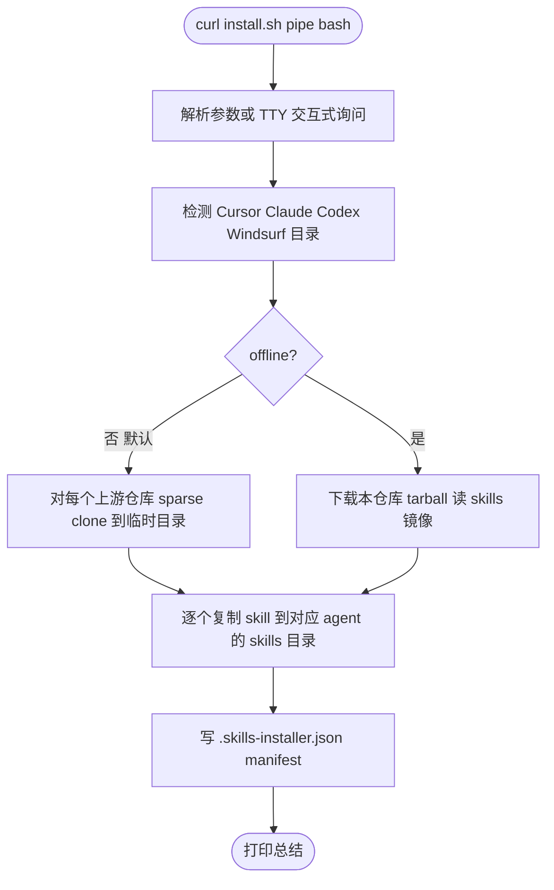

<div align="center">

# skills-installer

**一条命令，一次到位，把 6 个主流 agent skills 全局安装到 Cursor / Claude Code / Codex / Windsurf。**

<br />

[](https://github.com/2029193370/skills/actions/workflows/ci-lint.yml)
[](https://github.com/2029193370/skills/actions/workflows/codeql.yml)
[](https://github.com/2029193370/skills/actions/workflows/zizmor.yml)
[](https://github.com/2029193370/skills/actions/workflows/gitleaks.yml)
[](https://github.com/2029193370/skills/actions/workflows/scorecard.yml)
[](./LICENSE)

[English](./README.md) &nbsp;|&nbsp; **简体中文**

[快速开始](#快速开始) &nbsp;·&nbsp; [内置 skills](#内置-skills) &nbsp;·&nbsp; [目标 agent](#支持的-agent) &nbsp;·&nbsp; [命令行参考](#命令行参考) &nbsp;·&nbsp; [FAQ](#faq)

</div>

---

## 快速开始

### macOS / Linux / WSL / Git Bash

```bash
curl -fsSL https://raw.githubusercontent.com/2029193370/skills/main/scripts/install.sh | bash
```

### Windows PowerShell

```powershell
iwr -useb https://raw.githubusercontent.com/2029193370/skills/main/scripts/install.ps1 | iex
```

这条命令会自动做完四件事：

1. 检测你机器上装过的 agent（Cursor / Claude Code / Codex / Windsurf）。
2. 从上游仓库按子目录 sparse clone 要装的 skills（只下载实际需要的字节）。
3. 把每个 skill 放进每一个检测到的 agent 的全局 skills 目录。
4. 写一个小 manifest，`--uninstall` 能精确撤销。

非交互式（适合 CI 或 dotfiles 脚本）：

```bash
curl -fsSL https://raw.githubusercontent.com/2029193370/skills/main/scripts/install.sh \
  | bash -s -- --agent=cursor --skills=superpowers,find-skills --yes
```

---

## 内置 skills

所有条目都定义在 [`registry.json`](./registry.json)。自定义添加请见 [`docs/ADDING_A_SKILL.md`](./docs/ADDING_A_SKILL.md)。

| Skill | 作用 | 上游 | License |
| --- | --- | --- | --- |
| `document-skills` | 读写 Excel / Word / PDF / PPT | [anthropics/skills](https://github.com/anthropics/skills) | Source-available |
| `frontend-design` | 生产级前端界面设计 | [anthropics/skills](https://github.com/anthropics/skills) | Source-available |
| `skill-creator` | 创建、评测、迭代你自己的 skills | [anthropics/skills](https://github.com/anthropics/skills) | Source-available |
| `ui-ux-pro-max` | 57 套 UI 风格、95 种配色、56 组字体、98 条 UX 准则 | [nextlevelbuilder/ui-ux-pro-max-skill](https://github.com/nextlevelbuilder/ui-ux-pro-max-skill) | MIT |
| `find-skills` | 当你问"有没有做 X 的 skill"时自动搜索与安装 | [aqianer/find-skills](https://github.com/aqianer/find-skills) | MIT |
| `superpowers` | 30+ 元技能：头脑风暴 / 计划 / TDD / 子 agent 派发 | [obra/superpowers-skills](https://github.com/obra/superpowers-skills) | MIT |

> **关于 License。** 三个 Anthropic 官方 skill 以 *source-available* 许可证发布，不允许二次分发。**本项目从不在自己的仓库里内置它们**：在线模式下你的机器直接从上游拉，这是许可证允许的。`--offline` 模式会跳过它们并提示，仅内置 3 个 MIT skill 作为离线镜像（见 [`skills/`](./skills/)）。

---

## 支持的 agent

| Agent | 如何检测 | 全局 skills 路径 | 项目 skills 路径 |
| --- | --- | --- | --- |
| Cursor | 存在 `~/.cursor/` | `~/.cursor/skills/` | `./.cursor/skills/` |
| Claude Code | 存在 `~/.claude/`（或 `$CLAUDE_CONFIG_DIR`） | `~/.claude/skills/` | `./.claude/skills/` |
| Codex CLI | 存在 `~/.codex/` | `~/.codex/skills/` | *（不支持项目级）* |
| Windsurf | 存在 `~/.codeium/windsurf/` | `~/.codeium/windsurf/skills/` | `./.windsurf/skills/` |

需要装到当前项目就加 `--scope=project`；想装到全局（默认）就直接跑。

---

## 命令行参考

```
Usage: install.sh [选项]

动作：
  --install                  （默认）
  --uninstall                按 manifest 反向删除
  --list                     预览会往哪里放什么，不写盘

选择：
  --agent=<all|cursor|claude|codex|windsurf>    目标 agent，默认 all（仅安装已检测到的）
  --scope=<global|project>                      作用域，默认 global
  --skills=<all|name1,name2,...>                要装的 skill，默认 all

模式：
  --offline                  走内置 MIT 镜像，不联网；Anthropic 的 3 个会被跳过
  --force                    已有同名目录也覆盖，不问
  --dry-run                  只打印将会做什么，不写盘
  --yes, -y                  所有提示默认 yes（CI / 管道安全）

环境变量：
  SKILLS_INSTALLER_REPO    默认 2029193370/skills
  SKILLS_INSTALLER_REF     默认 main（分支 / tag / 提交 SHA）
```

PowerShell 使用 PascalCase 同名参数：`-Agent`、`-Scope`、`-Skills`、`-Offline`、`-Force`、`-DryRun`、`-Yes`、`-Action`。

### 例子

```bash
# 预览，什么都不写
curl -fsSL .../install.sh | bash -s -- --list

# 只装 2 个 skill 到 Cursor 全局
curl -fsSL .../install.sh | bash -s -- --agent=cursor --skills=superpowers,find-skills

# 装到当前项目（monorepo 场景）
curl -fsSL .../install.sh | bash -s -- --scope=project

# 离线 + pin 到 release tag
SKILLS_INSTALLER_REF=v1.0.0 \
  curl -fsSL .../install.sh | bash -s -- --offline

# 全部卸载
curl -fsSL .../install.sh | bash -s -- --uninstall --agent=all
```

---

## 工作流程



每个 skill 都走 `git clone --depth 1 --filter=blob:none --sparse` + `git sparse-checkout set <paths>` 来抓取，遇到 `anthropics/skills` 这样的大 monorepo 也只下载你真正要装的那个子目录。

---

## FAQ

### 为什么 `--offline` 会跳过一半的 skill？

Anthropic 的三个 skill（`document-skills` / `frontend-design` / `skill-creator`）是 *source-available*，不允许再分发。把它们塞进本仓库就构成了再分发。默认在线模式下你的机器直接从上游拉一份给自己用，这是合法的。MIT 许可证的另外 3 个则可以被镜像到 [`skills/`](./skills/) 供离线使用。

### 想加自己的 skill 怎么办？

给 [`registry.json`](./registry.json) 加一条即可。schema 见 [`registry.schema.json`](./registry.schema.json)、[`docs/ADDING_A_SKILL.md`](./docs/ADDING_A_SKILL.md)。如果你的 skill 是 MIT / Apache / BSD 许可证，希望它支持 `--offline`，把 `redistributable` 设为 `true`，下一次 `scripts/sync-upstream.sh` 会把它拉到镜像。

### 怎么升级已安装的 skill？

重跑一键命令加 `--force`，会用上游最新版覆盖本地。如果想要确定性升级，pin 到 `SKILLS_INSTALLER_REF=vX.Y.Z`。

### 安装到底放了哪些东西？

每个 agent 的 skills 目录下会有 `.skills-installer.json`，里面列出了安装过的每条路径和当时的 ref。`--uninstall` 就是读这个 manifest 精确删除的。

### 必须联网吗？

不必。`--offline` 会下载本仓库的 tarball（约 300 KB），把里面的 MIT skill 镜像拷给你。Anthropic 的三个会被跳过，提示你联网重跑。

### 想 pin 到具体版本？

```bash
SKILLS_INSTALLER_REF=v1.0.0 curl -fsSL \
  https://raw.githubusercontent.com/2029193370/skills/v1.0.0/scripts/install.sh | bash
```

代码和 registry 都会在该 ref 解析，行为完全可复现。

### `curl | bash` 安全吗？

脚本本身很小，跑之前可以读：

```bash
curl -fsSL https://raw.githubusercontent.com/2029193370/skills/main/scripts/install.sh | less
```

脚本只往已检测到的 agent skills 目录写文件、再加一个 manifest；不改 PATH、不动 shell rc、不写注册表、不装二进制。

---

## 安全

- 没有埋点、没有 analytics、没有后台进程。
- 本仓库 CI 使用的每个 GitHub Action 都 SHA-pin，Dependabot 自动保持新。
- 安装器的所有写操作都在已检测到的 agent skills 目录内，加一个 manifest 文件。
- 私密漏洞报告走 GitHub Security Advisories，见 [`SECURITY.md`](./SECURITY.md)。

---

## 贡献

欢迎 PR：新增 skill 到 `registry.json`、增加 agent 目标、翻译文档。先看 [`CONTRIBUTING.md`](./CONTRIBUTING.md)。PR 标题必须是 [Conventional Commits](https://www.conventionalcommits.org/) 格式，release notes 从中自动生成。

---

## 贡献者

<a href="https://github.com/2029193370/skills/graphs/contributors">
  
</a>

_图片由 [contrib.rocks](https://contrib.rocks) 生成。_

---

## Star History

<a href="https://star-history.com/#2029193370/skills&Date">
  <picture>
    <source media="(prefers-color-scheme: dark)" srcset="https://api.star-history.com/svg?repos=2029193370/skills&type=Date&theme=dark" />
    <source media="(prefers-color-scheme: light)" srcset="https://api.star-history.com/svg?repos=2029193370/skills&type=Date" />
    
  </picture>
</a>

---

## License

本仓库以 [MIT](./LICENSE) 发布。被安装的 skills 保留其**各自的** license，详见上表上游链接。

---

## 致谢

- [anthropics/skills](https://github.com/anthropics/skills) — `document-skills` / `frontend-design` / `skill-creator` 的上游。
- [obra/superpowers-skills](https://github.com/obra/superpowers-skills) — agentic 软件开发方法论。
- [nextlevelbuilder/ui-ux-pro-max-skill](https://github.com/nextlevelbuilder/ui-ux-pro-max-skill) — UI/UX 设计智能 skill。
- [aqianer/find-skills](https://github.com/aqianer/find-skills) — skill 发现工具。
